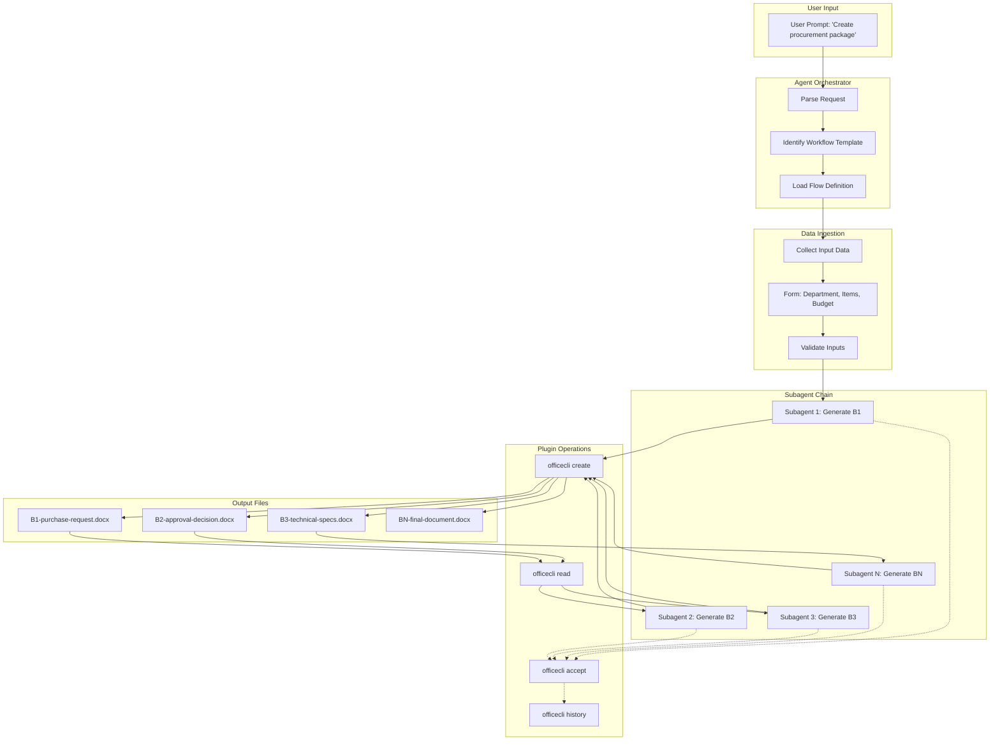
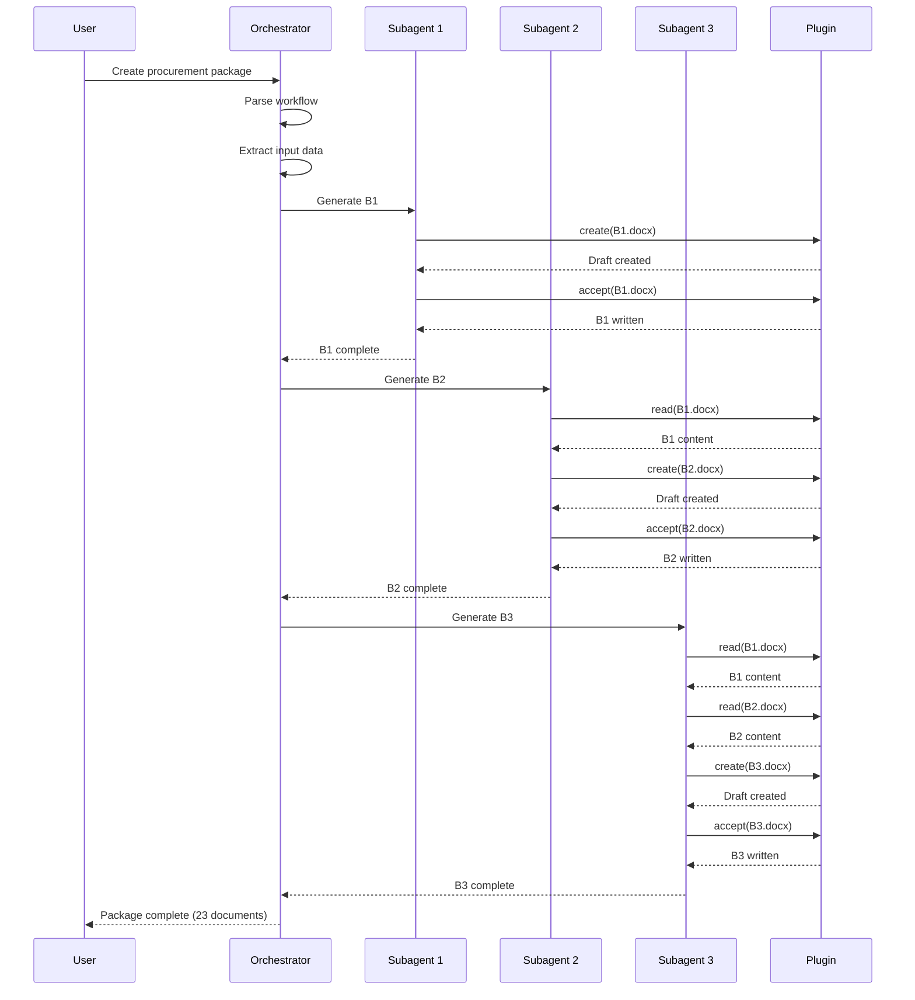

# Full Flow: Prompt → Documents

## Architecture Diagram



## Detailed Flow

### Phase 1: Prompt Input
```
User: "Create procurement package for Microbiology department, 
       100 reagent kits, budget $5000"
```

### Phase 2: Flow Resolution
```javascript
// Agent identify workflow
const workflow = {
  name: "procurement-23steps",
  steps: [
    { id: "B1", template: "purchase-request.docx", depends: [] },
    { id: "B2", template: "approval-decision.docx", depends: ["B1"] },
    { id: "B3", template: "technical-specs.docx", depends: ["B1", "B2"] },
    // ... B4-B23
  ]
}
```

### Phase 3: Data Ingestion
```javascript
// Extract structured data from prompt
const inputData = {
  department: "Microbiology",
  items: [{ name: "Reagent kits", quantity: 100, unit: "tests" }],
  budget: 5000,
  date: "12/08/2026"
}
```

### Phase 4: Subagent Execution (Chain)

#### Subagent 1: Generate B1
```javascript
// Input: inputData
// Output: B1-purchase-request.docx

const b1Content = `
# Purchase Request
Department: ${inputData.department}
Items: ${inputData.items.map(i => `- ${i.name}: ${i.quantity} ${i.unit}`).join('\n')}
Budget: $${inputData.budget}
`

await officecli.create("./procurement/B1.docx", b1Content)
await officecli.accept("./procurement/B1.docx")
```

#### Subagent 2: Generate B2 (reads B1)
```javascript
// Input: B1 content + inputData
// Output: B2-approval-decision.docx

const b1 = await officecli.read("./procurement/B1.docx")
const b2Content = `
# Approval Decision
Based on: ${b1}
Approved: ${inputData.items[0].name}
Budget: $${inputData.budget}
`

await officecli.create("./procurement/B2.docx", b2Content)
await officecli.accept("./procurement/B2.docx")
```

#### Subagent 3: Generate B3 (reads B1 + B2)
```javascript
// Input: B1 + B2 content
// Output: B3-technical-specs.docx

const b1 = await officecli.read("./procurement/B1.docx")
const b2 = await officecli.read("./procurement/B2.docx")
const b3Content = `
# Technical Specifications
Reference: ${b1}
Approved by: ${b2}
Technical requirements: [generated from template]
`

await officecli.create("./procurement/B3.docx", b3Content)
await officecli.accept("./procurement/B3.docx")
```

### Phase 5: Output
```
./procurement/
├── B1-purchase-request.docx
├── B2-approval-decision.docx
├── B3-technical-specs.docx
├── ...
└── B23-payment-settlement.docx
```

## Subagent Orchestration Pattern



## Example: Full Procurement Flow

### Input
```
User: "Create procurement package for:
- Department: Microbiology
- Items: Reagent kits (100 tests), Pipettes (50 units)
- Budget: $10,000
- Deadline: 30 days"
```

### Orchestrator Logic
```javascript
async function generateProcurementPackage(input) {
  const steps = [
    { id: "B1", generate: generatePurchaseRequest },
    { id: "B2", generate: generateApprovalDecision, deps: ["B1"] },
    { id: "B3", generate: generateTechnicalSpecs, deps: ["B1", "B2"] },
    // ... B4-B23
  ]
  
  const results = {}
  
  for (const step of steps) {
    // Read dependencies
    const depContents = await Promise.all(
      step.deps.map(async (dep) => ({
        id: dep,
        content: await officecli.read(`./procurement/${dep}.docx`)
      }))
    )
    
    // Generate document
    const content = await step.generate(input, depContents)
    
    // Create + accept
    await officecli.create(`./procurement/${step.id}.docx`, content)
    await officecli.accept(`./procurement/${step.id}.docx`)
    
    results[step.id] = content
  }
  
  return results
}
```

### Output
```
✓ B1-purchase-request.docx (created)
✓ B2-approval-decision.docx (created, references B1)
✓ B3-technical-specs.docx (created, references B1+B2)
...
✓ B23-payment-settlement.docx (created, references all prior)

Total: 23 documents generated
History: All versions tracked
Locks: Released after each accept
```

## Key Concepts

1. **Prompt → Structured Data**: Agent parse natural language, extract key-value pairs
2. **Flow Template**: Pre-defined workflow (23 steps for procurement)
3. **Dependency Graph**: Each step know which prior documents it need
4. **Subagent Per Step**: Isolated execution, read dependencies, generate output
5. **Plugin as Infrastructure**: Storage, locks, conversion, history
6. **Chain Execution**: Sequential, each step wait for dependencies

## Benefits

- **Automation**: 23 documents from one prompt
- **Consistency**: Each document reference correct prior versions
- **Traceability**: History track all changes
- **Flexibility**: Can revert any step, regenerate downstream
- **Scalability**: Subagents parallelize where possible (B5, B6 independent)
