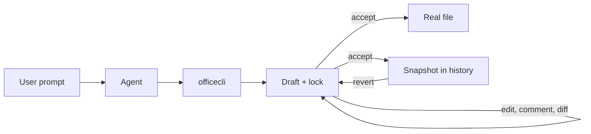

# @xirothedev/openoffice-plugin-opencode

[](https://www.npmjs.com/package/@xirothedev/openoffice-plugin-opencode)
[](https://github.com/xirothedev/opencode-office-plugin/actions/workflows/ci.yml)
[](https://opensource.org/licenses/MIT)

Office document automation for opencode 2 — draft lifecycle, version history, and format conversion for DOCX, XLSX, PPTX, PDF, images, and text.

**English** · [Tiếng Việt](README.vi.md)

## Contents

- [Overview](#overview)
- [The problem it solves](#the-problem-it-solves)
- [Why use it](#why-use-it)
- [Install](#install)
- [Quick start](#quick-start)
- [Usage](#usage)
- [How it works](#how-it-works)
- [Core concepts](#core-concepts)
- [Supported formats](#supported-formats)
- [Data storage and options](#data-storage-and-options)
- [Documentation](#documentation)
- [License](#license)

## Overview

`@xirothedev/openoffice-plugin-opencode` is a plugin for **opencode 2** that gives the agent a single safe path for every Office document operation: it registers the `officecli` tool (31 actions) and intercepts the builtin `read`/`edit`/`write` tools for office formats, so document work cannot bypass the lifecycle.

The agent never touches a real file directly. Every change lands in a **Draft** held under an exclusive lock; the real file is written only on `accept`, which also records a **Snapshot** for `history` and `revert`.

## The problem it solves

Text-first agents are bad at binary documents:

1. **Text tools corrupt Office files** — editing a DOCX/XLSX/PPTX/PDF as plain text breaks the ZIP/XML structure and the file stops opening.
2. **Direct writes have no undo** — a wrong overwrite destroys the original.
3. **Parallel sessions collide** — two sessions editing the same file silently overwrite each other.
4. **Agent edits are invisible** — no audit trail of what changed, when, or by which session.
5. **Repetitive document chains don't scale** — real workflows produce the same set of documents over and over (see below).

### Real-world example: hospital procurement

A Vietnamese hospital procurement dossier needs ~23 ordered documents (B1 purchase request → B23 payment settlement). With a `{{placeholder}}` template, the plugin generates the whole chain in one call:

```text
# 1. Create a template with {{var}} placeholders
officecli(action="create", filePath="./templates/decision-template.md",
  content="# Decision {{NUMBER}}\n\nDepartment: {{DEPT}}\n\nAmount: {{AMOUNT}}")
officecli(action="accept", filePath="./templates/decision-template.md")

# 2. Generate 50 decisions in one call (filePaths/dataArray are JSON strings)
officecli(action="generate",
  templatePath="./templates/decision-template.md",
  filePaths='["./decisions/dept-001.docx","./decisions/dept-002.docx", ...]',
  dataArray='[{"DEPT": "Microbiology", "NUMBER": 1, "AMOUNT": 10000}, ...]')
```

See [docs/WORKFLOWS.md](docs/WORKFLOWS.md) for the full procurement chain.

## Why use it

- **Nothing lands until `accept`** — a wrong edit is discarded with `undo`, not recovered from a backup.
- **Version history built in** — every `accept` snapshots the file; `history` lists versions, `revert` restores one.
- **One writer at a time** — a per-file lock stops concurrent sessions from clobbering each other; stale locks are reclaimed after 24h by default.
- **One tool, every format** — read DOCX/XLSX/PPTX/PDF/images as Markdown, edit, write back to the original format.
- **Reviewable changes** — suggestion comments and DOCX track changes survive Office round-trips, so a human can approve edits in Word/Excel/PowerPoint.
- **Format-preserving generation** — `clone` + `substitute` + `verify-l3` keep OOXML byte-identical except text nodes (L3 Fidelity), ideal for procurement templates.
- **Local by default** — data stays on your machine; runtime captures are local JSON with no telemetry endpoint (ADR-0014).

## Install

### Requirements

| Requirement | Needed for | Notes |
|---|---|---|
| opencode 2 | everything | V2 plugin API (`Plugin.define`, `plugins` config field, `opencode2` CLI). Does not load in opencode V1. |
| pandoc | DOCX/XLSX/PPTX read & write | `brew install pandoc` (macOS) · `sudo apt-get install pandoc` (Linux) |
| LaTeX engine | PDF write | `xelatex` by default; override with `pdfEngine` or `OFFICECLI_PDF_ENGINE` (e.g. `typst`) |
| — | PDF extraction, image OCR | built in (`pdfjs-dist`, `pdf-inspector`, `anydoc`) |

### Plugin

Add the package to the `plugins` array in your opencode 2 config — `opencode.json` in the project, or the global config for all projects:

```json
{
  "plugins": ["@xirothedev/openoffice-plugin-opencode"]
}
```

opencode installs the package and its dependencies on startup. Version pinning, local development install, verification, and troubleshooting: [docs/INSTALL.md](docs/INSTALL.md).

### Skills

The plugin provides the tool; skills teach the agent when to use it. Install at least `office` — without it the agent may not route document work through `officecli`.

```bash
# With the plugin
./install.sh                  # macOS/Linux
.\install.ps1                 # Windows
# flags: --global | --project DIR | --skill-only | --plugin-only | --local

# Standalone (all skills, no plugin)
npx skills add xirothedev/opencode-office-plugin

# Manual, one skill at a time
cp -R skills/office ~/.config/opencode/skills/office   # global
cp -R skills/office .opencode/skills/office            # this project only
```

| Skill | When the agent uses it |
|---|---|
| `office` | **Main entry point.** Every read/create/edit/review/convert of `.docx/.xlsx/.pptx/.pdf`/images goes through `officecli`. Start here. |
| `docx` / `xlsx` / `pptx` / `pdf` | Format-deep work: polished Word reports, spreadsheet formulas/charts, slide decks, PDF merge/split/forms/OCR. |
| `skill-creator` | Turn a repetitive document task into a reusable Task Skill (`grill` → `write`). |

`install.sh` / `install.ps1` copy only `skills/office` — add the format skills with option 2 or 3. Restart opencode after installing, then try: `Create a Word document at /tmp/test.docx` — the agent should invoke the `office` skill and call `officecli`.

## Quick start

1. Install the plugin and skills (above), then restart opencode.
2. Ask for a document in plain language:

```text
Create a Word document at ./report.docx with a project summary table
```

3. The agent calls `officecli`, and the draft lifecycle takes over:

| Action | What happens |
|---|---|
| `create` | draft born — the real file is not written yet |
| `edit` / `comment` | draft updated in place (locked) |
| `read` / `diff` / `preview` | inspect the draft without touching the real file |
| `accept` | real file written, Snapshot recorded, lock released |
| `undo` | draft discarded, real file untouched |

## Usage

`officecli` is one tool with 31 actions:

| Group | Actions |
|---|---|
| Lifecycle | `create` `edit` `read` `accept` `undo` `history` `revert` `diff` |
| Drafts & locks | `list` `lock-status` `force-release` |
| Comments & review | `comment` `list-comments` `approve` `deny-comment` `resolve-comment` `edit-comment` `delete-comment` `track-insert` `track-delete` `review` |
| Conversion & output | `export` `preview` `metadata` `watermark` `annotate` `validate` |
| Templates & fidelity | `clone` `substitute` `generate` `verify-l3` |

### Core flow

```text
officecli(action="create", filePath="/path/to/doc.docx", content="# My Document\n\nContent here")
officecli(action="read", filePath="/path/to/doc.pdf")          # any format → Markdown
officecli(action="edit", filePath="/path/to/doc.docx", content="# Updated content")
officecli(action="diff", filePath="/path/to/doc.docx")         # draft vs real file
officecli(action="accept", filePath="/path/to/doc.docx")       # write + snapshot + unlock
officecli(action="undo", filePath="/path/to/doc.docx")         # discard draft
officecli(action="history", filePath="/path/to/doc.docx")      # list snapshots
officecli(action="revert", filePath="/path/to/doc.docx", timestamp=1234567890)
```

`revert` creates a draft from a Snapshot — call `accept` to write it.

### Review before overwrite

On documents the agent did not create in the current session, content changes default to **suggestion comments** instead of direct edits:

```text
officecli(action="edit", filePath="/path/to/report.docx", content="# Updated draft")
officecli(action="comment", filePath="/path/to/report.docx", commentId="c1",
  author="AI Agent", commentText="Tighten summary",
  suggestedText="Revised paragraph text",
  rangeStartParagraph=0, rangeStartOffset=0, rangeEndParagraph=0, rangeEndOffset=10)
officecli(action="list-comments", filePath="/path/to/report.docx")
officecli(action="approve", filePath="/path/to/report.docx", commentId="c1")
officecli(action="accept", filePath="/path/to/report.docx")
```

Suggestions anchor to a paragraph (DOCX), cell (`cellRef`, XLSX), or slide (`slide`, PPTX). Comments survive Office round-trips, so a user can review or resolve them in Word/Excel/PowerPoint; `review` summarizes comments and track changes on any file. Details: [docs/COMMENT-WORKFLOW.md](docs/COMMENT-WORKFLOW.md).

## How it works



- **Draft lifecycle** — every change lands in a draft; only `accept` promotes it to the real file.
- **Lock = claim** — the first mutating action acquires a per-file lock; it releases on `accept`/`undo`, and stale locks are reclaimed after `staleLockHours` (default 24).
- **Format conversion** — binary formats convert to Markdown for reading and back for writing (PDF via pandoc + xelatex); text files are handled directly.

### Architecture

```text
src/
├── plugin/    # opencode entry: Plugin.define, tool registration, edit-tool override, blocking hook
└── core/
    ├── draft/     # draft lifecycle, locks, diff, sidecars
    ├── format/    # read/write/convert: docx, xlsx, pdf, image, OOXML parts
    ├── template/  # clone + substitute, batch generate
    ├── comments/  # single comment intake for OOXML comments
    └── storage/   # paths + registry (SHA-256 path hash → document)
```

The plugin targets the opencode V2 plugin API: `Plugin.define({ id: "openoffice", effect })`, tools added through `ctx.tool.transform`, options read from `ctx.options`, and real failures thrown as typed `Tool.Error`. Full design: [docs/DESIGN.md](docs/DESIGN.md) · decisions: [docs/adr/](docs/adr/).

### Tech stack

| Layer | Choice |
|---|---|
| Language | TypeScript (strict, ES2022) |
| Runtime & package manager | Bun |
| Plugin API | opencode V2 (`@opencode/plugin`, `@opencode/schema`, `effect`) |
| Office backends | `docx`, `exceljs`, `pdf-lib`, `pdfjs-dist`, `jszip`, `xml2js`, `sharp`, pandoc |
| Tests | `bun test` + coverage (lcov) |
| Lint & build | oxlint · `tsc` + `tsc-alias` · Turbo |
| CI/CD | GitHub Actions → npm publish on `v*` tags with provenance |

### Development

```bash
bun install
bun run check      # turbo: lint + typecheck + test + build
bun run test       # bun test
bun run build      # tsc + tsc-alias → dist/
```

Release: tag `vX.Y.Z` and push — CD takes the npm version from the tag and publishes with provenance. More in [docs/TESTING.md](docs/TESTING.md); the end-to-end harness lives in [tests/isolated-workspace](tests/isolated-workspace/).

## Core concepts

| Term | Meaning |
|---|---|
| **Draft** | Editable copy of a document under an exclusive lock; all edits happen here. |
| **Accept** | Promotes a Draft to a Snapshot and writes the real file — the single write path. |
| **Snapshot** | Immutable version stored on each `accept`; powers `history` and `revert`. |
| **Lock** | Claim on a file held by one session; prevents concurrent writes. |
| **Sidecar** | JSON holding non-content mutations (comments, track-change state) applied at `accept`. |
| **Task Skill** | An opencode skill that automates one repetitive document task (`grill` → `write`). |

Canonical definitions: [CONTEXT.md](CONTEXT.md) · language rules: [docs/CONTEXT.md](docs/CONTEXT.md).

## Supported formats

| Format | Read | Write | Backend |
|---|---|---|---|
| Text (txt, md, …) | ✅ | ✅ | Native |
| PDF | ✅ | ✅ | pandoc + xelatex (read: pdfjs-dist + pdf-inspector) |
| DOCX | ✅ | ✅ | anydoc + docx library |
| XLSX | ✅ | ✅ | anydoc + exceljs |
| PPTX | ✅ | ✅ | anydoc + pandoc |
| Images (PNG, JPG) | ✅ | ✅ | anydoc + sharp |

All formats support a full read/write cycle. PDF write requires a LaTeX engine (xelatex); override with the `pdfEngine` option (e.g. `typst`) or `OFFICECLI_PDF_ENGINE`.

**Export fidelity**: `export` converts between PDF/DOCX/XLSX/PPTX through the Markdown pipeline, so layout, tables, and styling are approximate — text content is preserved, fine formatting is not. Layout-sensitive conversions (e.g. PDF → DOCX) are best-effort: use them for text extraction and lightweight editing, not pixel-perfect round-trips.

## Data storage and options

Plugin data lives in `~/.local/share/opencode/plugins/openoffice/` by default:

- `drafts/` — active drafts
- `locks/` — session locks
- `history/` — Snapshot versions
- `registry/` — hash → path index (powers `list`)
- `sidecars/` — non-content mutations

Configure via the `options` object of the plugin entry:

```json
{
  "plugins": [
    {
      "package": "@xirothedev/openoffice-plugin-opencode",
      "options": {
        "pdfEngine": "typst",
        "staleLockHours": 48,
        "dataDir": "/shared/office-plugin-data"
      }
    }
  ]
}
```

| Option | Default | Purpose |
|---|---|---|
| `pdfEngine` | `xelatex` | pandoc PDF engine (env fallback `OFFICECLI_PDF_ENGINE`) |
| `staleLockHours` | `24` | lock staleness threshold |
| `dataDir` | `~/.local/share/opencode/plugins/openoffice/` | plugin data directory |

## Documentation

- [Install](docs/INSTALL.md) — published and local dev install, verification, troubleshooting
- [Changelog](CHANGELOG.md) — release history
- [Design](docs/DESIGN.md) — architecture and data schema
- [Context](docs/CONTEXT.md) — domain glossary and language rules
- [Testing](docs/TESTING.md) — local development guide
- [Workflows](docs/WORKFLOWS.md) — common usage patterns
- [Comment Workflow](docs/COMMENT-WORKFLOW.md) — comments and track changes
- [Full Flow](docs/FULL-FLOW.md) — end-to-end orchestration
- [ADRs](docs/adr/) — architecture decisions
- [Skills](skills/) — agent skills shipped with the plugin

## License

MIT
