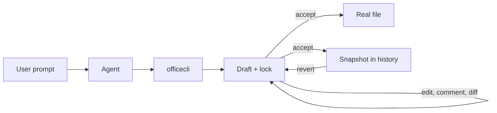

# @xirothedev/openoffice-plugin-opencode

[](https://www.npmjs.com/package/@xirothedev/openoffice-plugin-opencode)
[](https://github.com/xirothedev/opencode-office-plugin/actions/workflows/ci.yml)
[](https://opensource.org/licenses/MIT)

Plugin tự động hoá tài liệu Office cho opencode 2 — vòng đời Draft, lịch sử phiên bản và chuyển đổi định dạng cho DOCX, XLSX, PPTX, PDF, ảnh và văn bản.

[English](README.md) · **Tiếng Việt**

## Mục lục

- [Tổng quan](#tổng-quan)
- [Vấn đề giải quyết](#vấn-đề-giải-quyết)
- [Lợi ích khi sử dụng](#lợi-ích-khi-sử-dụng)
- [Cài đặt](#cài-đặt)
- [Bắt đầu nhanh](#bắt-đầu-nhanh)
- [Cách sử dụng](#cách-sử-dụng)
- [Cách hoạt động](#cách-hoạt-động)
- [Khái niệm cốt lõi](#khái-niệm-cốt-lõi)
- [Định dạng hỗ trợ](#định-dạng-hỗ-trợ)
- [Lưu trữ và tuỳ chọn](#lưu-trữ-và-tuỳ-chọn)
- [Tài liệu](#tài-liệu)
- [Giấy phép](#giấy-phép)

## Tổng quan

`@xirothedev/openoffice-plugin-opencode` là plugin cho **opencode 2**, đưa mọi thao tác tài liệu Office của agent về một đường đi an toàn duy nhất: plugin đăng ký tool `officecli` (31 action) và chặn các tool builtin `read`/`edit`/`write` với định dạng Office, để công việc tài liệu không thể đi vòng qua vòng đời Draft.

Agent không bao giờ ghi trực tiếp vào file thật. Mọi thay đổi nằm trong một **Draft** (bản nháp) đang giữ lock độc quyền; file thật chỉ được ghi khi gọi `accept` — thao tác này đồng thời ghi một **Snapshot** cho `history` và `revert`.

## Vấn đề giải quyết

Agent vốn giỏi văn bản nhưng yếu với tài liệu nhị phân:

1. **Tool văn bản làm hỏng file Office** — sửa DOCX/XLSX/PPTX/PDF như văn bản thường sẽ phá cấu trúc ZIP/XML và file không mở được nữa.
2. **Ghi trực tiếp không có hoàn tác** — một lần ghi đè sai là mất bản gốc.
3. **Nhiều phiên chạy đè lên nhau** — hai session sửa cùng một file sẽ âm thầm ghi đè lẫn nhau.
4. **Thay đổi của agent không có dấu vết** — không biết cái gì đã đổi, lúc nào, bởi session nào.
5. **Chuỗi tài liệu lặp lại không thể làm thủ công** — các quy trình thực tế sản sinh cùng một bộ tài liệu hết lần này tới lần khác (xem bên dưới).

### Ví dụ thực tế: mua sắm tại bệnh viện

Một hồ sơ mua sắm của bệnh viện Việt Nam cần ~23 tài liệu theo thứ tự (B1 đề nghị mua sắm → B23 thanh toán, quyết toán). Với template `{{placeholder}}`, plugin sinh cả chuỗi chỉ trong một lệnh gọi:

```text
# 1. Tạo template với placeholder {{var}}
officecli(action="create", filePath="./templates/decision-template.md",
  content="# Quyết định {{NUMBER}}\n\nKhoa: {{DEPT}}\n\nSố tiền: {{AMOUNT}}")
officecli(action="accept", filePath="./templates/decision-template.md")

# 2. Sinh 50 quyết định trong một lệnh (filePaths/dataArray là JSON string)
officecli(action="generate",
  templatePath="./templates/decision-template.md",
  filePaths='["./decisions/dept-001.docx","./decisions/dept-002.docx", ...]',
  dataArray='[{"DEPT": "Vi sinh", "NUMBER": 1, "AMOUNT": 10000}, ...]')
```

Xem [docs/WORKFLOWS.md](docs/WORKFLOWS.md) cho toàn bộ chuỗi mua sắm.

## Lợi ích khi sử dụng

- **Chưa `accept` thì chưa có gì thay đổi** — bản sửa sai chỉ cần `undo`, không phải khôi phục từ backup.
- **Lịch sử phiên bản có sẵn** — mỗi `accept` tạo một Snapshot; `history` liệt kê, `revert` khôi phục.
- **Một người ghi tại một thời điểm** — lock theo file ngăn các session ghi đè nhau; lock quá hạn được thu hồi sau 24h mặc định.
- **Một tool cho mọi định dạng** — đọc DOCX/XLSX/PPTX/PDF/ảnh ra Markdown, sửa, rồi ghi ngược về định dạng gốc.
- **Thay đổi duyệt được** — bình luận gợi ý và track changes của DOCX sống sót qua các vòng Office, để người dùng duyệt trong Word/Excel/PowerPoint.
- **Sinh tài liệu giữ nguyên định dạng** — `clone` + `substitute` + `verify-l3` giữ OOXML giống hệt từng byte trừ text node (L3 Fidelity), lý tưởng cho template mua sắm.
- **Mặc định chạy local** — dữ liệu nằm trên máy bạn; capture runtime là JSON local, không có endpoint telemetry (ADR-0014).

## Cài đặt

### Yêu cầu

| Yêu cầu | Dùng cho | Ghi chú |
|---|---|---|
| opencode 2 | tất cả | plugin API V2 (`Plugin.define`, trường config `plugins`, CLI `opencode2`). Không chạy trên opencode V1. |
| pandoc | đọc & ghi DOCX/XLSX/PPTX | `brew install pandoc` (macOS) · `sudo apt-get install pandoc` (Linux) |
| LaTeX engine | ghi PDF | mặc định `xelatex`; đổi bằng option `pdfEngine` hoặc `OFFICECLI_PDF_ENGINE` (ví dụ `typst`) |
| — | trích xuất PDF, OCR ảnh | tích hợp sẵn (`pdfjs-dist`, `pdf-inspector`, `anydoc`) |

### Plugin

Thêm package vào mảng `plugins` trong config opencode 2 — `opencode.json` của project, hoặc config global cho mọi project:

```json
{
  "plugins": ["@xirothedev/openoffice-plugin-opencode"]
}
```

opencode tự cài package và dependencies khi khởi động. Ghim phiên bản, cài cho phát triển local, kiểm tra và xử lý sự cố: [docs/INSTALL.md](docs/INSTALL.md).

### Skills

Plugin cung cấp tool; skills dạy agent khi nào dùng tool đó. Hãy cài tối thiểu skill `office` — thiếu nó, agent có thể không định tuyến công việc tài liệu qua `officecli`.

```bash
# Cài kèm plugin
./install.sh                  # macOS/Linux
.\install.ps1                 # Windows
# flags: --global | --project DIR | --skill-only | --plugin-only | --local

# Độc lập (toàn bộ skills, không cần plugin)
npx skills add xirothedev/opencode-office-plugin

# Thủ công, từng skill một
cp -R skills/office ~/.config/opencode/skills/office   # global
cp -R skills/office .opencode/skills/office            # chỉ project này
```

| Skill | Khi nào agent dùng |
|---|---|
| `office` | **Điểm vào chính.** Mọi thao tác đọc/tạo/sửa/duyệt/chuyển đổi `.docx/.xlsx/.pptx/.pdf`/ảnh đều qua `officecli`. Bắt đầu từ đây. |
| `docx` / `xlsx` / `pptx` / `pdf` | Việc chuyên sâu theo định dạng: báo cáo Word chỉn chu, công thức/biểu đồ bảng tính, slide, PDF merge/split/form/OCR. |
| `skill-creator` | Biến một việc tài liệu lặp lại thành Task Skill tái sử dụng (`grill` → `write`). |

`install.sh` / `install.ps1` chỉ copy `skills/office` — thêm các skill theo định dạng bằng cách 2 hoặc 3. Khởi động lại opencode sau khi cài, rồi thử: `Create a Word document at /tmp/test.docx` — agent sẽ gọi skill `office` và tool `officecli`.

## Bắt đầu nhanh

1. Cài plugin và skills (ở trên), rồi khởi động lại opencode.
2. Yêu cầu tài liệu bằng ngôn ngữ tự nhiên:

```text
Create a Word document at ./report.docx with a project summary table
```

3. Agent gọi `officecli`, và vòng đời Draft tiếp quản:

| Action | Điều gì xảy ra |
|---|---|
| `create` | Draft được sinh — file thật chưa bị ghi |
| `edit` / `comment` | Draft được cập nhật tại chỗ (đang giữ lock) |
| `read` / `diff` / `preview` | Xem Draft mà không đụng vào file thật |
| `accept` | Ghi file thật, lưu Snapshot, giải phóng lock |
| `undo` | Bỏ Draft, file thật không đổi |

## Cách sử dụng

`officecli` là một tool với 31 action:

| Nhóm | Actions |
|---|---|
| Vòng đời | `create` `edit` `read` `accept` `undo` `history` `revert` `diff` |
| Draft & lock | `list` `lock-status` `force-release` |
| Bình luận & duyệt | `comment` `list-comments` `approve` `deny-comment` `resolve-comment` `edit-comment` `delete-comment` `track-insert` `track-delete` `review` |
| Chuyển đổi & xuất | `export` `preview` `metadata` `watermark` `annotate` `validate` |
| Template & độ trung thực | `clone` `substitute` `generate` `verify-l3` |

### Luồng chính

```text
officecli(action="create", filePath="/path/to/doc.docx", content="# My Document\n\nContent here")
officecli(action="read", filePath="/path/to/doc.pdf")          # mọi định dạng → Markdown
officecli(action="edit", filePath="/path/to/doc.docx", content="# Updated content")
officecli(action="diff", filePath="/path/to/doc.docx")         # draft vs file thật
officecli(action="accept", filePath="/path/to/doc.docx")       # ghi + snapshot + mở lock
officecli(action="undo", filePath="/path/to/doc.docx")         # bỏ draft
officecli(action="history", filePath="/path/to/doc.docx")      # liệt kê snapshot
officecli(action="revert", filePath="/path/to/doc.docx", timestamp=1234567890)
```

`revert` tạo draft từ một Snapshot — gọi `accept` để ghi.

### Duyệt trước khi ghi đè

Với tài liệu không do agent tạo trong session hiện tại, thay đổi nội dung mặc định thành **bình luận gợi ý** thay vì sửa trực tiếp:

```text
officecli(action="edit", filePath="/path/to/report.docx", content="# Updated draft")
officecli(action="comment", filePath="/path/to/report.docx", commentId="c1",
  author="AI Agent", commentText="Tighten summary",
  suggestedText="Revised paragraph text",
  rangeStartParagraph=0, rangeStartOffset=0, rangeEndParagraph=0, rangeEndOffset=10)
officecli(action="list-comments", filePath="/path/to/report.docx")
officecli(action="approve", filePath="/path/to/report.docx", commentId="c1")
officecli(action="accept", filePath="/path/to/report.docx")
```

Gợi ý neo vào paragraph (DOCX), cell (`cellRef`, XLSX) hoặc slide (`slide`, PPTX). Bình luận sống sót qua các vòng Office, người dùng có thể duyệt hoặc resolve trong Word/Excel/PowerPoint; `review` tóm tắt bình luận và track changes trên mọi file. Chi tiết: [docs/COMMENT-WORKFLOW.md](docs/COMMENT-WORKFLOW.md).

## Cách hoạt động



- **Vòng đời Draft** — mọi thay đổi nằm trong draft; chỉ `accept` mới đưa nó vào file thật.
- **Lock = quyền ghi** — thao tác thay đổi đầu tiên sẽ giữ lock theo file; lock mở khi `accept`/`undo`, và lock quá hạn được thu hồi sau `staleLockHours` (mặc định 24).
- **Chuyển đổi định dạng** — định dạng nhị phân chuyển sang Markdown để đọc và ngược lại để ghi (PDF qua pandoc + xelatex); file văn bản xử lý trực tiếp.

### Kiến trúc

```text
src/
├── plugin/    # điểm vào opencode: Plugin.define, đăng ký tool, override tool edit, hook chặn
└── core/
    ├── draft/     # vòng đời draft, lock, diff, sidecar
    ├── format/    # đọc/ghi/chuyển đổi: docx, xlsx, pdf, image, OOXML parts
    ├── template/  # clone + substitute, sinh hàng loạt
    ├── comments/  # đầu mối duy nhất xử lý bình luận OOXML
    └── storage/   # đường dẫn + registry (hash đường dẫn SHA-256 → tài liệu)
```

Plugin dùng plugin API V2 của opencode: `Plugin.define({ id: "openoffice", effect })`, tool thêm qua `ctx.tool.transform`, option đọc từ `ctx.options`, lỗi thật ném ra dưới dạng `Tool.Error`. Thiết kế đầy đủ: [docs/DESIGN.md](docs/DESIGN.md) · quyết định: [docs/adr/](docs/adr/).

### Tech stack

| Tầng | Lựa chọn |
|---|---|
| Ngôn ngữ | TypeScript (strict, ES2022) |
| Runtime & package manager | Bun |
| Plugin API | opencode V2 (`@opencode/plugin`, `@opencode/schema`, `effect`) |
| Backend Office | `docx`, `exceljs`, `pdf-lib`, `pdfjs-dist`, `jszip`, `xml2js`, `sharp`, pandoc |
| Test | Vitest + coverage v8 |
| Lint & build | oxlint · `tsc` + `tsc-alias` · Turbo |
| CI/CD | GitHub Actions → publish npm khi tag `v*`, kèm provenance |

### Phát triển

```bash
bun install
bun run check      # turbo: lint + typecheck + test + build
bun run test       # vitest
bun run build      # tsc + tsc-alias → dist/
```

Phát hành: tạo tag `vX.Y.Z` và push — CD lấy version từ tag rồi publish lên npm kèm provenance. Xem thêm [docs/TESTING.md](docs/TESTING.md); harness end-to-end nằm ở [tests/isolated-workspace](tests/isolated-workspace/).

## Khái niệm cốt lõi

| Thuật ngữ | Ý nghĩa |
|---|---|
| **Draft** | Bản copy có thể sửa của tài liệu, giữ lock độc quyền; mọi chỉnh sửa diễn ra ở đây. |
| **Accept** | Đưa Draft thành Snapshot và ghi file thật — đường ghi duy nhất. |
| **Snapshot** | Phiên bản bất biến lưu sau mỗi `accept`; nuôi `history` và `revert`. |
| **Lock** | Quyền giữ file của một session; ngăn ghi đồng thời. |
| **Sidecar** | File JSON chứa thay đổi phi nội dung (bình luận, trạng thái track change), áp dụng lúc `accept`. |
| **Task Skill** | Skill opencode tự động hoá một việc tài liệu lặp lại (`grill` → `write`). |

Định nghĩa canonical: [CONTEXT.md](CONTEXT.md) · quy tắc ngôn ngữ: [docs/CONTEXT.md](docs/CONTEXT.md).

## Định dạng hỗ trợ

| Định dạng | Đọc | Ghi | Backend |
|---|---|---|---|
| Văn bản (txt, md, …) | ✅ | ✅ | Native |
| PDF | ✅ | ✅ | pandoc + xelatex (đọc: pdfjs-dist + pdf-inspector) |
| DOCX | ✅ | ✅ | anydoc + thư viện docx |
| XLSX | ✅ | ✅ | anydoc + exceljs |
| PPTX | ✅ | ✅ | anydoc + pandoc |
| Ảnh (PNG, JPG) | ✅ | ✅ | anydoc + sharp |

Mọi định dạng hỗ trợ trọn chu trình đọc/ghi. Ghi PDF cần LaTeX engine (xelatex); đổi bằng option `pdfEngine` (ví dụ `typst`) hoặc `OFFICECLI_PDF_ENGINE`.

**Độ trung thực khi export**: `export` chuyển đổi giữa PDF/DOCX/XLSX/PPTX qua pipeline Markdown, nên layout, bảng và style chỉ ở mức gần đúng — nội dung văn bản được giữ, định dạng chi tiết thì không. Các chuyển đổi nhạy layout (ví dụ PDF → DOCX) là best-effort: dùng để trích text và sửa nhẹ, không phải để round-trip chính xác từng pixel.

## Lưu trữ và tuỳ chọn

Dữ liệu plugin mặc định nằm ở `~/.local/share/opencode/plugins/openoffice/`:

- `drafts/` — các draft đang hoạt động
- `locks/` — lock của session
- `history/` — các phiên bản Snapshot
- `registry/` — chỉ mục hash → đường dẫn (phục vụ `list`)
- `sidecars/` — thay đổi phi nội dung

Cấu hình qua object `options` của entry plugin:

```json
{
  "plugins": [
    {
      "package": "@xirothedev/openoffice-plugin-opencode",
      "options": {
        "pdfEngine": "typst",
        "staleLockHours": 48,
        "dataDir": "/shared/office-plugin-data"
      }
    }
  ]
}
```

| Option | Mặc định | Ý nghĩa |
|---|---|---|
| `pdfEngine` | `xelatex` | pandoc PDF engine (env dự phòng `OFFICECLI_PDF_ENGINE`) |
| `staleLockHours` | `24` | ngưỡng lock quá hạn |
| `dataDir` | `~/.local/share/opencode/plugins/openoffice/` | thư mục dữ liệu plugin |

## Tài liệu

- [Install](docs/INSTALL.md) — cài đặt published + dev local, xác minh, xử lý sự cố
- [Changelog](CHANGELOG.md) — lịch sử phát hành
- [Design](docs/DESIGN.md) — kiến trúc và data schema
- [Context](docs/CONTEXT.md) — glossary domain và quy tắc ngôn ngữ
- [Testing](docs/TESTING.md) — hướng dẫn phát triển local
- [Workflows](docs/WORKFLOWS.md) — các pattern sử dụng thường gặp
- [Comment Workflow](docs/COMMENT-WORKFLOW.md) — bình luận và track changes
- [Full Flow](docs/FULL-FLOW.md) — orchestration end-to-end
- [ADRs](docs/adr/) — các quyết định kiến trúc
- [Skills](skills/) — agent skills đi kèm plugin

## Giấy phép

MIT
